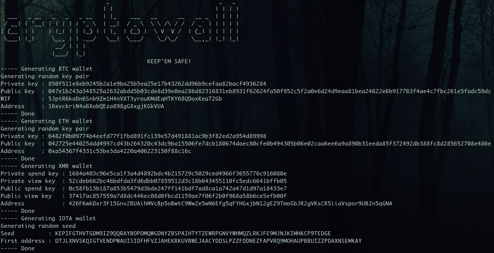

Cryptowall is an **offline** Docker container which generates random crypto wallets. It prints out the private key, public key, seed or any other usefull info to recover your wallet. It also gives the corresponding address to share in order to receive funds.

Commented scripts can be found in the folder named after the token. Methods used are described below & sources are given.

## Motivation

I wanted a tool to easily generate random wallets on the fly for various cryptocurrency. My scripts needed to be easily understood the transparent, that is why I shared the sources and used bash + OpenSSL where possible. For those who want to use my tool, the scripts needed to be computed offline to prevent any leak.

## Usage

Cryptowall currently supports Bitcoin, Ethereum and Iota tokens. Create an issue if you want a specific token to be implemented.

```sh
$ docker run --network=none lapwat/cryptowall btc eth xmr iota
```



## Methods used

### Bitcoin / Ethereum

I used the method and script described in [this excellent article](https://kobl.one/blog/create-full-ethereum-keypair-and-address) from Vincent Kobel. He explaines how to generate an ECDSA keypair with OpenSSL and how to derive the public key into the corresponding address.

I used [this method](https://en.bitcoin.it/wiki/Wallet_import_format) to convert the private key into Wallet Import Format. I used [this technique](https://en.bitcoin.it/wiki/Technical_background_of_version_1_Bitcoin_addresses) to convert the public key into the corresponding Bitcoin address.

### Monero

I followed the official *Mnemonic (Electrum or Deterministic) Style* explained at the bottom of [this page](https://xmr.llcoins.net/addresstests.html)

### Iota

I used the class _AddressGenerator_ from the official python library [pyota](https://github.com/iotaledger/iota.lib.py).
